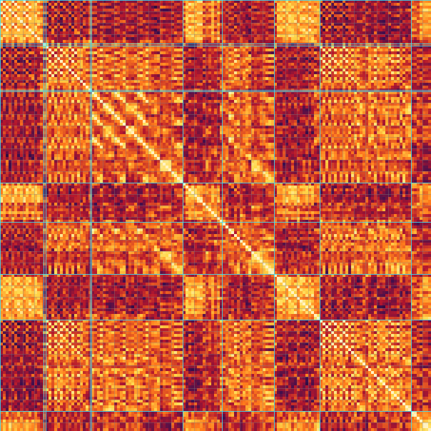
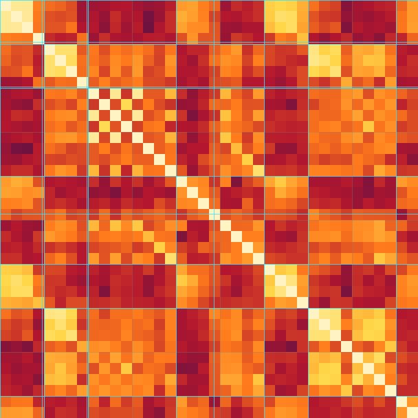

# PixelParade musical skeleton

Generated by `cmd/story` from `analysis/features.json` and the bass stem. Grid: 105.000 BPM, first beat 0.038 s, bar 2.2857 s, 38 bars. Every number below is a measurement with the limits listed at the end; listen before relying on it.

## Key

**G major** (Krumhansl–Kessler correlation 0.882). Runner-up: D major (0.801). Relative key E minor: 0.398 (margin 0.484 ≥ 0.05, not flagged ambiguous).

Input profile (other-stem chroma weighted by RMS, plus 0.5 × duration-weighted bass notes):

| C | C# | D | D# | E | F | F# | G | G# | A | A# | B |
|---:|---:|---:|---:|---:|---:|---:|---:|---:|---:|---:|---:|
| 0.123 | 0.031 | 0.251 | 0.028 | 0.069 | 0.015 | 0.082 | 0.169 | 0.013 | 0.104 | 0.011 | 0.104 |

## Grid check

Cue starts against the nearest bar line (bar n starts at 0.038 + n × 2.2857 s).

| Cue | Start | Nearest bar | Bar line | Δ |
|---|---:|---:|---:|---:|
| assembly | 0.000 s | 0 (position -0.02) | 0.038 s | -38 ms |
| first-pause | 8.746 s | 4 (position 3.81) | 9.181 s | -435 ms |
| first-parade | 9.168 s | 4 (position 3.99) | 9.181 s | -12 ms |
| second-pause | 18.050 s | 8 (position 7.88) | 18.324 s | -274 ms |
| interlocking-parade | 18.311 s | 8 (position 7.99) | 18.324 s | -13 ms |
| open-breakdown | 36.600 s | 16 (position 16.00) | 36.609 s | -9 ms |
| tunnel-return | 44.400 s | 19 (position 19.41) | 43.467 s | +933 ms |
| suspended-breakdown | 54.900 s | 24 (position 24.00) | 54.895 s | +5 ms |
| finale | 64.000 s | 28 (position 27.98) | 64.038 s | -38 ms |
| settle | 82.300 s | 36 (position 35.99) | 82.324 s | -24 ms |

## Chord chart

Chords are estimated per half bar from the other stem (RMS-weighted chroma) with a bass-root bonus, then Viterbi-smoothed. Labels: lowercase = bar similarity class, uppercase = 4-bar phrase.

| Bar | Time | Label | Phrase | Chords | Bass | Roles | Cue | Leitmotifs |
|---:|---:|---|---|---|---|---|---|---|
| 0 | 0:00.000 | a | A | Em7 |  | arp | assembly | M1 |
| 1 | 0:02.324 | a | A | Em7 |  | arp | assembly | M1 |
| 2 | 0:04.609 | a | A | Em7 |  | arp | assembly | M1 |
| 3 | 0:06.895 | b | A | Em7 | F | drums arp | assembly |  |
| 4 | 0:09.181 | c | B | Em7/D G/D | D | drums bass arp | first-parade | M1 |
| 5 | 0:11.467 | c | B | G/D G | D | drums bass arp | first-parade | M1 |
| 6 | 0:13.752 | c | B | G/D | D | drums bass arp | first-parade | M1 |
| 7 | 0:16.038 | d | B | Gmaj7 | G | drums bass arp | first-parade | M4 |
| 8 | 0:18.324 | e | C | C D | D | drums bass arp vocals | interlocking-parade | M2 |
| 9 | 0:20.609 | f | C | Gmaj7 Gmaj7/F# | G | drums bass arp | interlocking-parade | M5 |
| 10 | 0:22.895 | e | C | C D | D | drums bass arp | interlocking-parade | M2 |
| 11 | 0:25.181 | f | C | G | G | drums bass arp | interlocking-parade | M5 |
| 12 | 0:27.467 | e | D | G D | C | drums bass arp | interlocking-parade | M2 |
| 13 | 0:29.752 | g | D | B7/D# Em7 | E | drums bass arp vocals | interlocking-parade |  |
| 14 | 0:32.038 | h | D | Am7 | A | drums bass arp | interlocking-parade |  |
| 15 | 0:34.324 | e' | D | Am7 D | D | drums bass arp vocals | interlocking-parade |  |
| 16 | 0:36.609 | a' | E | Em7/D Bm7 | D | arp | open-breakdown |  |
| 17 | 0:38.895 | a' | E | Bm7 Bm7/A | A | lead arp | open-breakdown |  |
| 18 | 0:41.181 | i | E | Am B7 | A | arp | open-breakdown |  |
| 19 | 0:43.467 | j | E | Em/G Gmaj7 | G | drums arp | open-breakdown |  |
| 20 | 0:45.752 | e' | D' | C D7 | D | drums bass arp | tunnel-return | M2 M5 |
| 21 | 0:48.038 | g' | D' | B7 Gmaj7 | B | drums bass arp | tunnel-return | M2 |
| 22 | 0:50.324 | h' | D' | Am7 | A | drums bass lead arp vocals | tunnel-return |  |
| 23 | 0:52.609 | e | D' | D | D | drums bass arp vocals | tunnel-return |  |
| 24 | 0:54.895 | a' | A | G/D G | D | arp vocals | suspended-breakdown |  |
| 25 | 0:57.181 | a | A | G |  | arp | suspended-breakdown |  |
| 26 | 0:59.467 | a | A | G |  | arp vocals | suspended-breakdown |  |
| 27 | 1:01.752 | b' | A | G |  | drums arp | suspended-breakdown | M5 |
| 28 | 1:04.038 | c | B | G/D | D | drums bass arp | finale | M1 |
| 29 | 1:06.324 | c | B | G/D | D | drums bass arp | finale | M1 |
| 30 | 1:08.609 | c | B | G/D D | D | drums bass arp | finale | M1 |
| 31 | 1:10.895 | d' | B | D G | G | drums bass arp | finale | M4 |
| 32 | 1:13.181 | c' | B' | G/D | D | drums bass arp vocals | finale |  |
| 33 | 1:15.467 | c | B' | G/D | D | drums bass arp | finale | M5 |
| 34 | 1:17.752 | c | B' | G/D D | D | drums bass arp | finale | M5 |
| 35 | 1:20.038 | d' | B' | Gmaj7/D Gmaj7 | G | drums bass lead arp vocals | finale | M4 |
| 36 | 1:22.324 | k | F | C D | C | lead arp | settle | M5 |
| 37 | 1:24.609 | a' | F | G |  | lead | settle |  |

## Sections

Four-bar phrases from bar 0, labelled by bar-level self-similarity (same letter ≥ 0.60, primed variant ≥ 0.35).

Sequence: **A B C D E D' A B B' F**

| Phrase | Bars | Time | Cue at start | Similarity to first of letter |
|---|---:|---:|---|---:|
| A | 0–3 | 0:00.000–0:09.181 | assembly | 1.000 |
| B | 4–7 | 0:09.181–0:18.324 | first-parade | 1.000 |
| C | 8–11 | 0:18.324–0:27.467 | interlocking-parade | 1.000 |
| D | 12–15 | 0:27.467–0:36.609 | interlocking-parade | 1.000 |
| E | 16–19 | 0:36.609–0:45.752 | open-breakdown | 1.000 |
| D' | 20–23 | 0:45.752–0:54.895 | tunnel-return | 0.571 |
| A | 24–27 | 0:54.895–1:04.038 | suspended-breakdown | 0.612 |
| B | 28–31 | 1:04.038–1:13.181 | finale | 0.664 |
| B' | 32–35 | 1:13.181–1:22.324 | finale | 0.426 |
| F | 36–37 | 1:22.324–1:26.120 | settle | 1.000 |

### Boundary candidates

Foote novelty on the beat self-similarity matrix (checkerboard half width 8 beats); peaks are local maxima within ±4 beats above mean + 1.0 σ.

| Time | Beat | Bar position | Novelty | Nearest cue | Δ |
|---:|---:|---:|---:|---|---:|
| 8.609 s | 15 | 3.75 | 0.846 | first-pause | -0.137 s |
| 32.038 s | 56 | 14.00 | 0.591 | open-breakdown | -4.562 s |
| 37.181 s | 65 | 16.25 | 0.854 | open-breakdown | +0.581 s |
| 44.038 s | 77 | 19.25 | 0.608 | tunnel-return | -0.362 s |
| 54.895 s | 96 | 24.00 | 0.974 | suspended-breakdown | -0.005 s |
| 64.038 s | 112 | 28.00 | 1.000 | finale | +0.038 s |
| 82.324 s | 144 | 36.00 | 0.813 | settle | +0.024 s |

The 44.4 s cue sits at bar position 19.41. First strong drums onset within half a bar: 44.030 s snare (bar position 19.25). First strong bass onset within half a bar: 45.510 s (bar position 19.89). The nearest novelty peak is at 44.038 s (bar position 19.25, novelty 0.608, -0.362 s from the cue).

## Motifs

Leitmotifs (ranked) first, then the other note motifs. Transpositions are relative to the first occurrence and folded to ±6 semitones because the tracker's octave errors make octave and direction unreliable. Rhythm is the inter-onset sequence in sixteenths.

| Rank | Id | Source | Role | Prototype | Rhythm | Count | Salience | Chroma-confirmed |
|---:|---|---|---|---|---|---:|---:|---|
| 1 | M1 | lead | ostinato | G5 G4 B3 D5 G4 A4 B4 A4 B4 G4 G4 A4 | 2 1 1 1 1 1 1 1 1 2 2 | 9 | 0.765 | false |
| 2 | M2 | bass | ostinato | C2 C2 C2 C2 D2 D2 D#2 | 4 2 3 1 2 3 | 5 | 0.609 | true |
| 3 | M4 | bass | theme | C2 C2 C2 C2 D2 G1 G1 G1 G1 | 1 1 1 1 3 2 3 1 | 3 | 0.461 | false |
| 4 | M5 | lead | ostinato | G5 G4 D5 G5 D5 G4 | 1 2 1 1 1 | 8 | 0.433 | false |
|  | M3 | bass | ostinato | D2 D2 C2 C2 D2 | 1 2 4 1 | 9 | 0.576 | false |
|  | M6 | lead | theme | D5 G4 G4 G4 G4 A5 D4 D4 D4 D4 F#4 D4 | 2 1 1 1 1 1 2 1 1 2 1 | 3 | 0.420 | false |
|  | M7 | lead | theme | G5 D3 G5 F#5 F#5 F#3 G5 | 1 1 1 2 1 1 | 6 | 0.413 | false |
|  | M8 | lead | ostinato | G5 D5 G3 G4 G4 G4 F#5 A4 D5 F#4 G4 A4 A4 F#4 B4 | 1 1 1 2 1 1 1 1 1 1 1 1 1 1 | 3 | 0.337 | true |
|  | M9 | lead | theme | C4 G5 D5 G4 G4 | 1 1 2 1 | 4 | 0.290 | false |
|  | M10 | lead | theme | B4 B3 D#4 D#4 | 2 1 1 | 4 | 0.227 | false |
|  | M11 | lead | theme | E4 C5 G4 C5 | 1 1 1 | 4 | 0.173 | false |
|  | M12 | lead | theme | A3 D5 F#4 G4 B4 G4 B3 B4 | 1 1 1 1 1 1 1 | 3 | 0.165 | false |
|  | M13 | bass | theme | G1 G#1 G1 G1 G1 | 1 1 3 2 | 3 | 0.127 | false |
|  | M14 | bass | theme | G1 G1 G1 G1 G2 G2 | 3 2 2 1 1 | 3 | 0.073 | false |
|  | M15 | lead | theme | D4 B5 B5 B5 | 1 1 1 | 4 | 0.047 | false |
|  | M16 | bass | ostinato | A1 A1 A1 A1 A1 A1 A1 A1 | 3 1 3 1 2 2 3 | 3 | 0.000 | false |
|  | C1 | chroma | theme | G A G D G A G A |  | 3 | 1.297 | false |
|  | C2 | chroma | theme | G A B B |  | 5 | 1.006 | false |
|  | C3 | chroma | theme | D G A D |  | 6 | 0.935 | false |
|  | C4 | chroma | theme | G A D F# |  | 3 | 0.597 | false |

**M1** (lead ostinato, span 4.0 beats) occurrences:

- 0:00.038 (bar 0) T+0 varied, similarity 0.61
- 0:02.324 (bar 1) T+0 varied, similarity 0.61
- 0:04.609 (bar 2) T+0 varied, similarity 0.61
- 0:09.181 (bar 4) T+0 varied, similarity 0.67
- 0:11.467 (bar 5) T+0 varied, similarity 0.64
- 0:13.752 (bar 6) T+0 varied, similarity 0.69
- 1:04.038 (bar 28) T+0 varied, similarity 0.50
- 1:06.324 (bar 29) T+0 varied, similarity 0.64
- 1:08.609 (bar 30) T+0 exact, similarity 1.00

**M2** (bass ostinato, span 4.0 beats) occurrences:

- 0:18.324 (bar 8) T+0 varied, similarity 0.75
- 0:22.895 (bar 10) T+0 varied, similarity 0.61
- 0:27.467 (bar 12) T+0 exact, similarity 1.00
- 0:45.752 (bar 20) T+0 varied, similarity 0.62
- 0:48.038 (bar 21) T-1 transposed+varied, similarity 0.52

**M4** (bass theme, span 4.0 beats) occurrences:

- 0:16.038 (bar 7) T+0 varied, similarity 0.84
- 1:10.895 (bar 31) T+0 varied, similarity 0.70
- 1:20.038 (bar 35) T+0 exact, similarity 1.00

**M5** (lead ostinato, span 2.0 beats) occurrences:

- 0:20.609 (bar 9) T+0 varied, similarity 0.55
- 0:22.324 (bar 9) T+0 varied, similarity 0.50
- 0:26.895 (bar 11) T+0 varied, similarity 0.50
- 0:45.752 (bar 20) T+0 varied, similarity 0.50
- 1:02.895 (bar 27) T+0 varied, similarity 0.55
- 1:17.181 (bar 33) T+0 exact, similarity 1.00
- 1:19.467 (bar 34) T+0 varied, similarity 0.50
- 1:22.324 (bar 36) T+5 transposed+varied, similarity 0.63

## Self-similarity

Brighter = more similar (cosine of z-scored chroma, bass chroma, band and stem levels; bars add a drum grid). Grey lines every bar (beats) or phrase (bars); cyan lines at cue starts.

## Limitations

- Notes come from a monophonic harmonic-sum tracker on a polyphonic stem. The arpeggio's interleaved voices, octave errors and dropped notes limit note-level motif similarity to about 0.5–0.8 even for bars that sound identical; motif occurrences with similarity near the 0.5 grid threshold are uncertain.
- Grid motifs match notes by sixteenth position and pitch class inside bar or half-bar windows starting on bar/half-bar lines; the n-gram stage (8/6/4 notes, similarity ≥ 0.8) only covers what is left. Pickup figures that start off the grid can be missed or split.
- Octave correction votes across bars first and only then applies the local-median and neighbour rules; wide spreads (19 semitones, neighbours within 2) were chosen because the original 13/5 folded real arpeggio leaps.
- Chord symbols name the best template; with an arpeggio over a pedal bass, Em7 vs G6 and similar pairs are not distinguishable from chroma alone. Slash chords use the dominant bass pitch class when it is a non-root chord tone.
- Stem names are separation-model outputs. The vocal stem carries no lyrics and is treated as texture/leakage.
- Phrase labels assume 4-bar phrases from bar 0; the grid assumes constant tempo.

## Listening checklist

DAW setup: import `public/audio/PixelParade.wav` and `analysis/PixelParade.mid` both at time 0 (the MIDI tempo is 105.000 BPM and its tick 0 is audio time 0, so the first beat sits at 0.038 s). Solo the other stem (`analysis/stems/htdemucs/PixelParade/other.wav`) against the lead/arp tracks; play chords and bass tracks against the mix; the motif lane track has one key per leitmotif (36 + rank) and text events like `M1 T+0 varied`.

1. **0:00.038** — M1 (lead ostinato) first statement: G5 G4 B3 D5 G4 A4 B4 A4 B4 G4 G4 A4. Does the motif lane line up with what you hear?
2. **0:09.181** — M1 recurs (bar 4, T+0, varied, similarity 0.67) in first-parade. Is it audibly the same figure?
3. **0:18.324** — M2 (bass ostinato) first statement: C2 C2 C2 C2 D2 D2 D#2. Does the motif lane line up with what you hear?
4. **0:45.752** — M2 recurs (bar 20, T+0, varied, similarity 0.62) in tunnel-return. Is it audibly the same figure?
5. **0:16.038** — M4 (bass theme) first statement: C2 C2 C2 C2 D2 G1 G1 G1 G1. Does the motif lane line up with what you hear?
6. **1:10.895** — M4 recurs (bar 31, T+0, varied, similarity 0.70) in finale. Is it audibly the same figure?
7. **0:20.609** — M5 (lead ostinato) first statement: G5 G4 D5 G5 D5 G4. Does the motif lane line up with what you hear?
8. **0:45.752** — M5 recurs (bar 20, T+0, varied, similarity 0.50) in tunnel-return. Is it audibly the same figure?
9. **0:44.400** — The 44.4 s cue sits at bar position 19.41. First strong drums onset within half a bar: 44.030 s snare (bar position 19.25). First strong bass onset within half a bar: 45.510 s (bar position 19.89). The nearest novelty peak is at 44.038 s (bar position 19.25, novelty 0.608, -0.362 s from the cue). Listen for where the return actually starts.
10. **0:00.000** — Relative key: the estimate is G major (r 0.882) vs E minor (r 0.398). Does the opening (bars 0–3) and the end of the song feel resolved on G?
